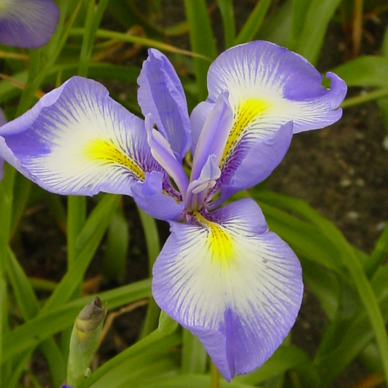

```{r setup, include=FALSE}
knitr::opts_chunk$set(echo = TRUE)
library(dplyr)
library(knitr)
library(stargazer)
```

```{r slika, message=FALSE, out.width="200", fig.align="center"}
# stretching slike ne dela, obdrzi aspect ratio
setwd("F:/Vaje/LabVaje/R Vaje/md")

```

```{r}
kable(head(mtcars), caption="MtCars")
```

```{r tabela, results='asis'}
stargazer(mtcars[1:5, 1:4], type = "html",
          title = "Cars with stargazer", summary=TRUE)
```


